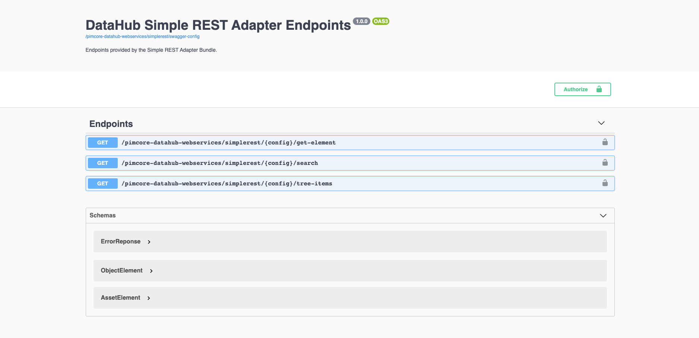

This bundle adds a simple read-only REST API endpoint to [Pimcore DataHub](https://github.com/pimcore/data-hub)
for Assets and DataObjects. All exposed data can be configured, is indexed in Elasticsearch and delivered from there
for better query performance and scalability.

Therefore, it can be used to connect Pimcore to other systems or to connect Front-End applications.

## Features in a nutshell
* Configure a schema and expose data like with other DataHub adapters via Drag & Drop.
* All data gets indexed in Elasticsearch indices and delivered from there (no additional load on the database
  when accessing data via REST endpoints).
* Endpoint documentation and test via Swagger UI.
* Available endpoints:
  * **tree-items**: Method to load all elements of a tree level with additional support for:
    * paging
    * filtering
    * fulltext search
    * ordering
    * aggregations – provide possible values for fields to create filters
  * **search**: Method to search for elements, returns elements of all types (no folder structures)
    with additional support for:
    * paging
    * filtering
    * fulltext search
    * ordering
    * aggregations – provide possible values for fields to create filters
  * **get-element**: Method to get one single element by type and ID.
* Endpoint security via bearer token that has to be sent as header with every request.

## Further Information
* [Installation & Bundle Configuration](docs/00-installation-configuration.md)
* [Endpoint Configuration Details](docs/01-endpoint-configuration.md)
* [Indexing Details](docs/02-indexing.md)

## License
**CI HUB GmbH**, Benkertstrasse 4, 14467 Potsdam, Germany  
[ci-hub.com](https://ci-hub.com), info@ci-hub.com  
Copyright © 2021 CI HUB GmbH. All rights reserved.

For licensing details please visit [LICENSE.md](LICENSE.md)
