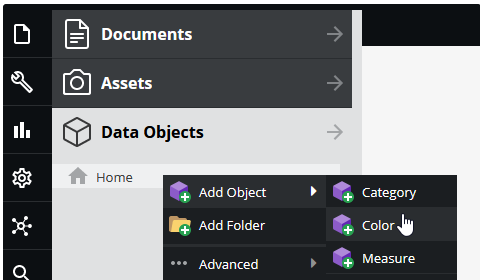
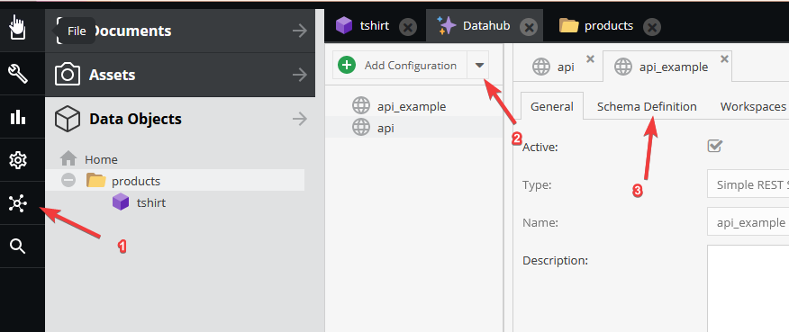
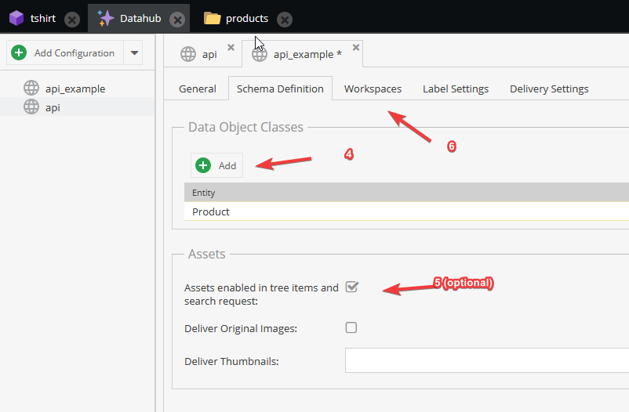
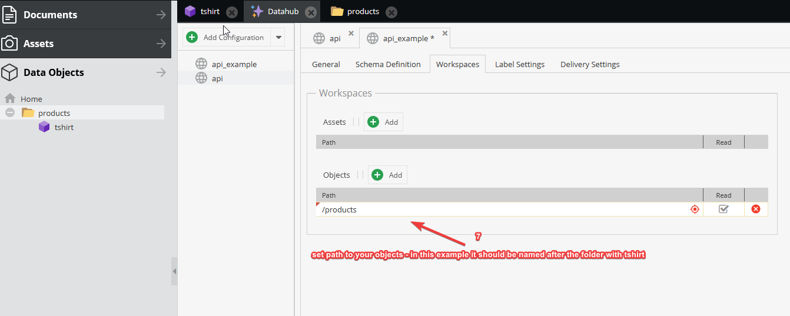
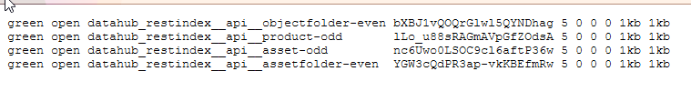
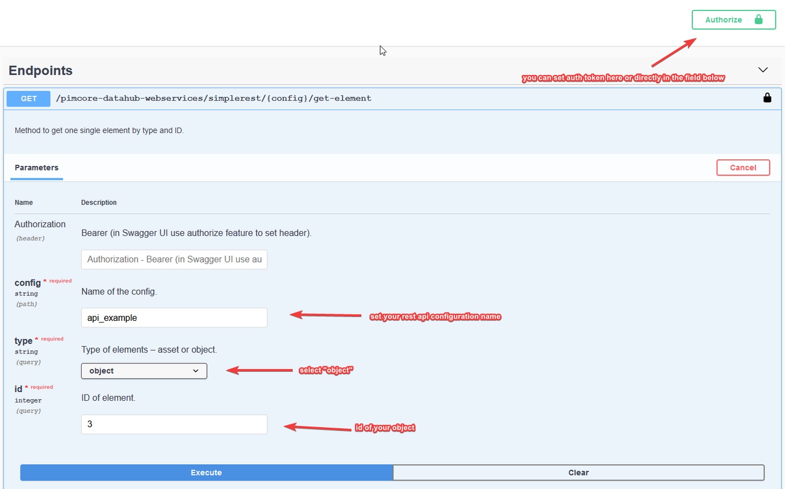
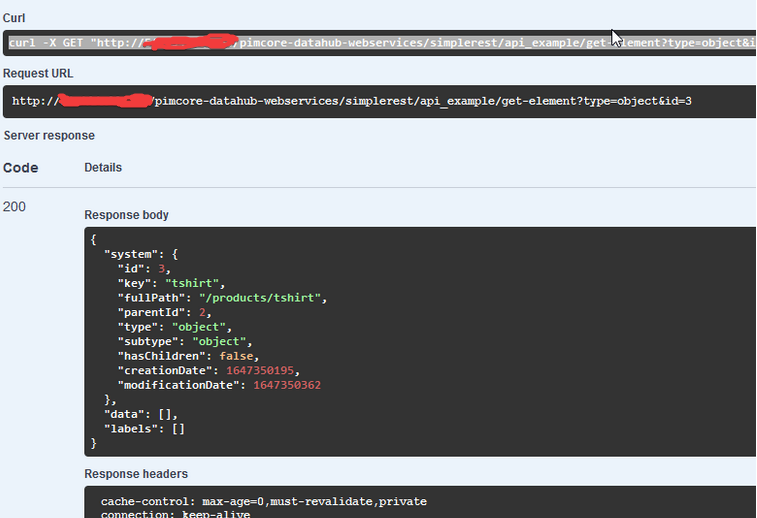

# Installation
This bundle depends on the [Pimcore DataHub](https://github.com/pimcore/data-hub), which needs to be installed first.

To install the Simple REST Adapter complete following steps:
* Install via composer
  ```
  composer require ci-hub/simple-rest-adapter-bundle
  ```
* Enable via command-line (or inside the Pimcore extension manager)
  ```
  bin/console pimcore:bundle:enable SimpleRESTAdapterBundle
  ```
* Clear cache and reload Pimcore
  ```
  bin/console cache:clear --no-warmup
  ```

> Make sure, that the priority of the Pimcore DataHub is higher than the priority of the Simple REST Adapter.
> This can be specified as parameter of the `pimcore:bundle:enable` command or in the Pimcore extension manager.

## Docker

If your Pimcore instance installed via [docker approach](https://github.com/pimcore/skeleton#docker), you can follow 
this section.

First, install bundles:
```
# 1. datahub
docker-compose exec php-fpm composer require pimcore/data-hub
docker-compose exec php-fpm php bin/console pimcore:bundle:enable PimcoreDataHubBundle
docker-compose exec php-fpm php bin/console pimcore:bundle:install PimcoreDataHubBundle

# 2. SimpleRESTAdapterBundle
docker-compose exec php-fpm composer require ci-hub/simple-rest-adapter-bundle
docker-compose exec php-fpm bin/console pimcore:bundle:enable SimpleRESTAdapterBundle
```

Next we need to add elasticsearch for proper work of SimpleRESTAdapterBundle.
- Stop the container:
```
docker-compose down
```

- Modify `<your-pimcore-project>/docker-compose.yml` (only elasticsearch config additions described below):
```
version: '2.4'
services:

    elasticsearch:
        image: docker.elastic.co/elasticsearch/elasticsearch:8.1.0
        container_name: elasticsearch
        environment:
          - xpack.security.enabled=false
          - discovery.type=single-node
        ulimits:
          memlock:
            soft: -1
            hard: -1
          nofile:
            soft: 65536
            hard: 65536
        cap_add:
          - IPC_LOCK
        volumes:
          - elasticsearch-data:/usr/share/elasticsearch/data
        ports:
          - 9200:9200
          - 9300:9300

# .....

volumes:
    # ...
    elasticsearch-data:
      driver: local
```

Note that used version of elasticsearch here is 8.1 - sometimes it might be a problem with indices creation on version 7.4. 
Looks like 7.17.0 also works, but be careful - **you can’t downgrade** (at least somehow fast and easy :) ).

- Modify `<your-pimcore-project>/config/config.yaml` according section [#Bundle Configuration](https://github.com/CI-HUB-GmbH/SimpleRESTAdapterBundle/blob/master/docs/00-installation-configuration.md#bundle-configuration) below.

**Note that** if you are using version 8.0 and above of elasticsearch, you should set `tokenizer->datahub_ngram_tokenizer->type` as `ngram`, not `nGram`.

- To keep indexing running optionally you can add message consumer queue into supervisord config 
(`<your-pimcore-project>/.docker/supervisord.conf`):
```
command=php /var/www/html/bin/console messenger:consume pimcore_core pimcore_maintenance datahub_es_index_queue --memory-limit=250M --time-limit=3600 -vv
```
Or keep it running somehow else (through crontab for example).

## Bundle Configuration
Configure Elasticsearch hosts and index name prefix with Symfony configuration:

```yaml
# Default configuration for "SimpleRESTAdapterBundle"
simple_rest_adapter:

    # Prefix for index names.
    index_name_prefix:    datahub_restindex

    # List of Elasticsearch hosts.
    es_hosts:

        # Default:
        - localhost

    # Global Elasticsearch index settings.
    index_settings:

        # Defaults:
        number_of_shards:    5
        number_of_replicas:  0
        max_ngram_diff:      20
        analysis:
            analyzer:
                datahub_ngram_analyzer:
                    type:                custom
                    tokenizer:           datahub_ngram_tokenizer
                    filter:
                        - lowercase
                datahub_whitespace_analyzer:
                    type:                custom
                    tokenizer:           datahub_whitespace_tokenizer
                    filter:
                        - lowercase
            normalizer:
                lowercase:
                    type:                custom
                    filter:
                        - lowercase
            tokenizer:
                datahub_ngram_tokenizer:
                    type:                nGram
                    min_gram:            2
                    max_gram:            20
                    token_chars:
                        - letter
                        - digit
                datahub_whitespace_tokenizer:
                    type:                whitespace
```

> Supported Elasticsearch version: ^7.0

To make sure the indexing queue is processed and index is filled, following command has to be executed on
a regular basis, e.g. every 5 minutes.

```
*/5 * * * * php /var/www/html/bin/console messenger:consume datahub_es_index_queue --limit=20 --time-limit=240 >/dev/null 2>&1
```

## Checking installation
To be sure the installation is correct, we need to check it properly.

- Start the container:
```
docker-compose up # -d if needed detached
```

- Create some classes and then objects:


  

- Create new datahub configuration:



  

- Set the Datahub Api Key at the tab `Delivery Setting` and save the configuration.

If everything went correctly, indices will be created. You can check them here (locally): http://localhost:9200/_cat/indices



- Now you can do some api calls. For example, from swagger page.

At the last tab in the configuration - “delivery settings“ - there are links to swagger and api endpoints.



Do some calls through swagger or curl or your preferred tool.

Successful response looks like this:


