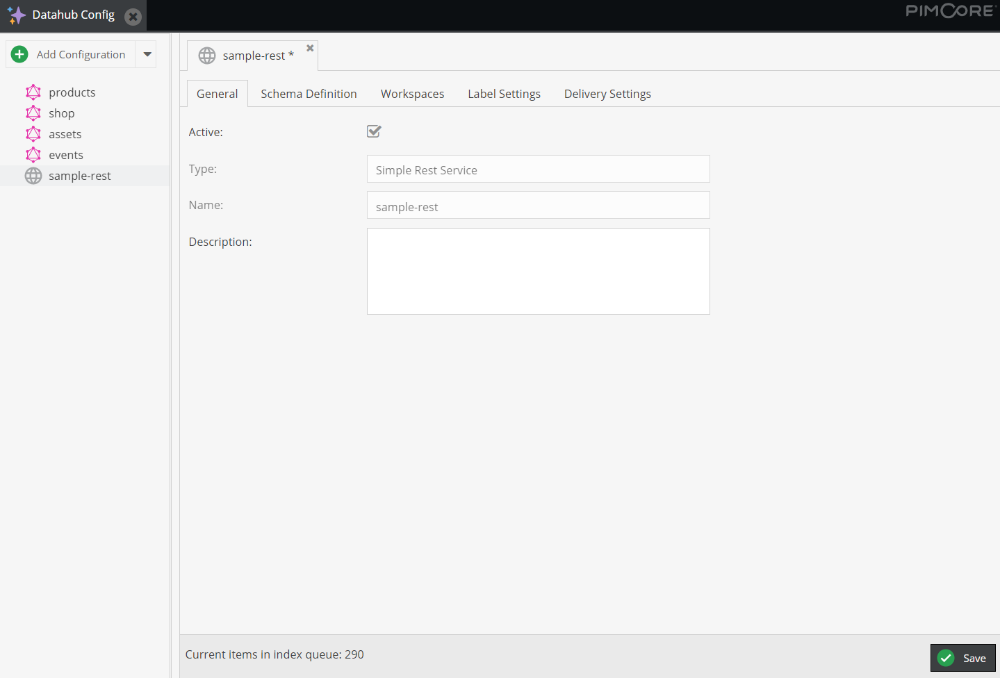
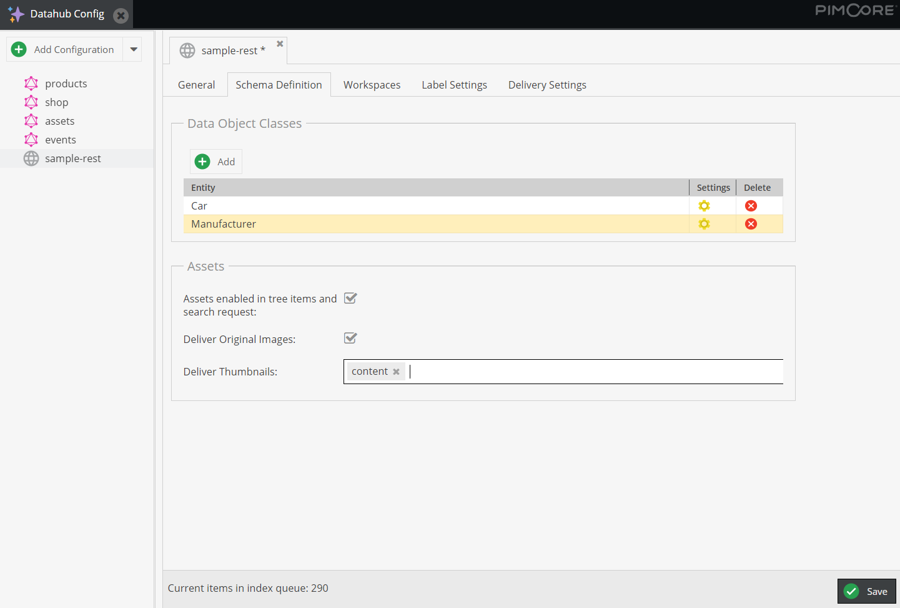
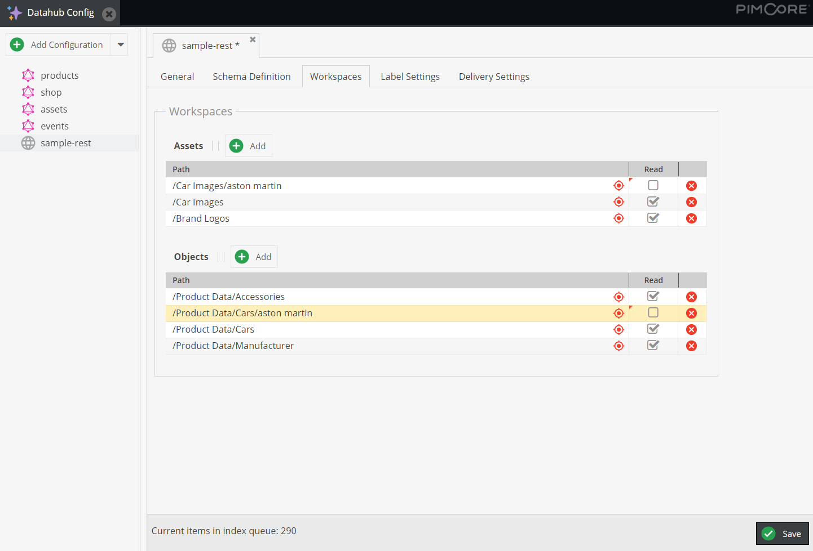
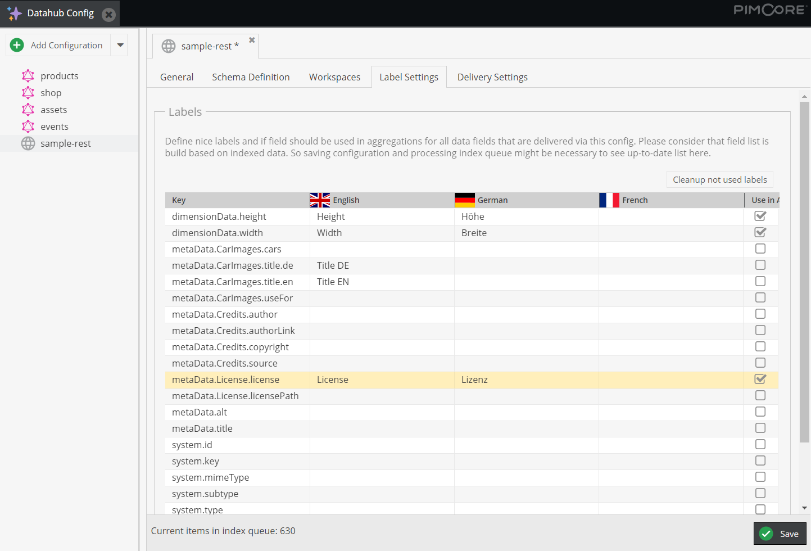
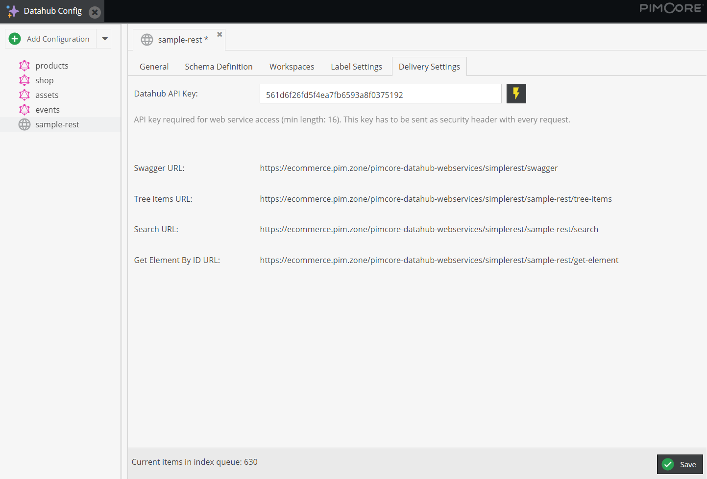

# Endpoint Configuration Details
Every DataHub configuration creates a separate endpoint with its own settings and its own data.
Following configuration options are possible for each endpoint.

### General
See type and name of configuration and define description and if the endpoint is active or not.

### Schema Definition
Define available data entities and their schema (= available fields) for the endpoint. Also define if Assets should
be considered in tree items and search requests and if originals and/or what thumbnails should be used for delivery.

### Workspaces
Define workspaces for Assets and DataObjects and so manage what data should be actually exposed via the endpoint.
It is possible to include and explicitly exclude folders.

### Label Settings
Define nice looking labels for different languages for each field. Each request includes the labels for used fields in
response in an additional data structure. They then can be used by the client application.

Additionally define what fields will be considered for aggregation calculation for facet navigation.

> Please consider that the field list is build based on indexed data. So saving the configuration and processing
> index queue might be necessary to see up-to-date list here.

### Delivery Settings
Define (or generate) an API key for securing the endpoint.
This API key needs to be sent as security header with every request.

